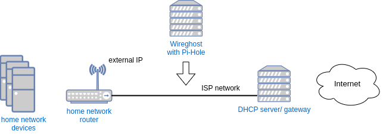

# WIREGHOST
### Plug-And-Play network device, with no need of a configuration or even an IP-address, with the goal of quick and easy deployment of a server/filter in an arbitrary network

**What is this?**

This script enables the device it is run on to participate
actively in a network, without the need of any configuration
or even an IP-address.

The device can (have to) be connected between two other working
network devices. Its default mode is bridge, so there will be
no effect on the network. While in a bridge mode it will
collect and analyze the passing data. Based on this it can
detect the network parameters and also the direction of its
position. When switched to a full-mode, Wireghost uses the
IP address of the internal device to participate on the
network on its own, while still allowing the communication
between the available devices.

So, it basically allows for an IP address to be used twice
on the same network.

An example of a possible usage scenario is to install a DNS
filter (<a href="https://pi-hole.net/">Pi-Hole</a>) on the
Wireghost device, then just plug it after the router and profit.
The available firewall makes sure that all DNS requests are
intercepted and answered through Pi-Hole.
The upstream server is from cloudflare (1.1.1.1), so
we also use DNS-over-HTTPS. No intervention or changes are needed
on the other network devices and the presence of Wireghost
can only be found when explicitly searching for it.
The Wireghost device can be accessed from the inside network
on 99.99.99.99 (this can be changed - see the "conf" folder).

**Setup**

This script is tested on Raspberry Pi4 both with Raspberry Pi OS
32 and 64 bit. The GPIO pins on the Pi are used for
a primitive feedback using LEDs and for a switch to control
the working mode (bridge/full mode). See the main script for
the numbers and adjust if needed. The script makes use of
some additional software, which is all available from the
standard repositories and also the Pi-Hole software, which
comes with a nice setup script.

**Function**

This script is meant to be run automatically as a cron job on
@reboot, but can also be started directly. Calling it without
any parameters will show the usage with a short explanation.
When manually called it can be stopped with Ctrl-C, which will
also take care of stopping the background functions. If the
script runs in the background ot can be stopped by sending
USR1 to it. For this you will need its PID, which the script
saves in "/home/pi/BOX/PID" (See also helpers/kill_loop.sh).

**WIP**

This is definately not finished and there are some issues to
be addressed - see TODO.md for the most important ones.

**Additional notes**

- The main script is <a href="BOX/BOXrun.sh">BOX/BOXrun.sh</a>
- It does not matter if the network uses DHCP or static settings;
- After switching to a full-mode-operation all network activities
on the device are possible;
- A connection on the edge of a network offers the most
possibilities: data filter, firewall, external access, etc.

This repository contains the further work on the project from my
<a href="https://github.com/vlzware/AKAD_BEDEN/tree/master/Bachelorarbeit">bachelor thesis</a>
(See the <a href="CHANGELOG">CHANGELOG</a> for more information)
