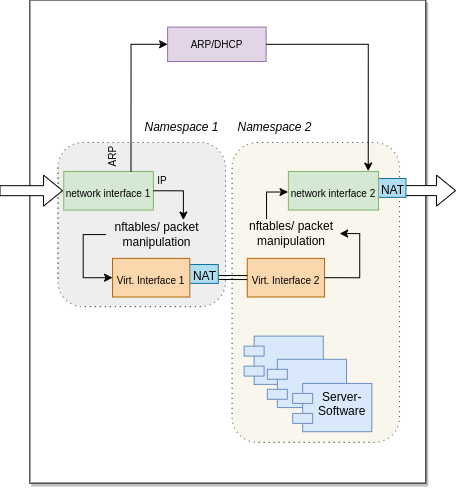

# WIREGHOST
### Plug-And-Play network device, with no need of a configuration or even an IP-address, with the goal of quick and easy deployment of a server/filter in an arbitrary network

- It is possible to use an already available IP-Address twice through virtualization;
- It does not matter if the network uses DHCP or static settings;
- The new device is undetectable, without explicit targeted search;
- It starts as a fully-transparent network bridge, observing and analyzing data;
- The device calculates all the data it needs to work in the network fully atomatically;
- After switching to a full-mode-operation all network activities are possible;
- To show one possible usecase scenario we deploy and use <a href="https://pi-hole.net/">PiHole</a> - a DNS-Filter;
- A connection on the edge of a network offers the most possibilities: data filter, firewall, external access, etc.

This repository contains the further work on the project from my <a href="https://github.com/vlzware/AKAD_BEDEN/tree/master/Bachelorarbeit">bachelor thesis</a>  (See the <a href="CHANGELOG">CHANGELOG</a> for more information)
